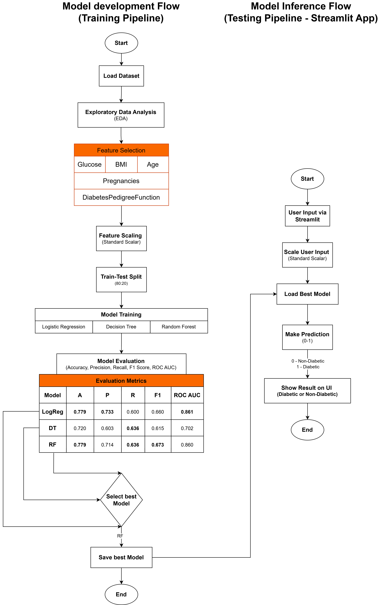

# Internship Report - Diabetes Prediction Project Using Pima Indians Dataset

## Project Summary

### Idea behind making this project:
With the rising prevalence of diabetes globally, early prediction and prevention have become crucial. This project was undertaken with the aim of using data-driven approaches to detect the likelihood of diabetes in individuals based on medical indicators. The idea was to learn and develop a machine learning model that could assist healthcare professionals in early diagnosis and risk assessment, especially in resource-constrained environments and getting familiar with real word problems.

--- 

### About the project:

The project, titled “Diabetes Prediction using Machine Learning”, focused on analyzing and modeling the Pima Indians Diabetes Dataset. The dataset contains medical records of female patients of Pima Indian heritage, including features such as glucose level, BMI, age, insulin level, blood pressure, skin thickness, diabetes pedigree function and number of pregnancies. The target variable indicates whether a patient is diabetic or not. The goal was to apply classification algorithms to predict whether a patient has diabetes (binary outcome: 0 = no, 1 = yes) using these features. The project covered data preprocessing, feature analysis, model training, and evaluation of classification performance using various metrics.

---

## Software used in the project:

The following software and libraries were used:

- **Python 3.11.11** – for all programming tasks

- **Jupyter Notebook** and **Sublime Text Editor** – as the coding environment

- Libraries:
    - **Pandas**, **NumPy** – for data manipulation
    - **Matplotlib**, **Seaborn** – for data visualization
    - **Scikit-learn** – for building and evaluating machine learning models

---

## Result or Working of the project:

The dataset was cleaned by identifying and imputing biologically implausible values – such as zero blood pressure or glucose – which were treated as missing and replaced with median of valid entries. Exploratory Data Analysis (EDA) was conducted to understand feature distributions and correlations with the target variable (Outcome). Based on statistical insights and medical relevance, features like Glucose, BMI, Age, and Diabetes Pedigree Function were selected.

Three models — **Logistic Regression**, **Decision Tree Classifier** and **Random Forest Classifier** — were trained and tested. All models were tested using metrics including accuracy, precision, recall, F1 score, and ROC AUC. Among them, the Random Forest Classifier delivered the most balanced and reliable performance, achieving an **accuracy** of approximately **0.78**, a **precision** of **0.71**, a **recall** of **0.63**, and an **F1 score** of **0.67** for the diabetic class.

These results indicate that the **Random Forest model** was more effective in identifying diabetic patients while minimizing **false negatives**. The final model was saved and deployed in a Streamlit-based interface for real-time prediction and user interaction.

### Any research done?

Yes. Prior to implementation, research was conducted to understand the medical and statistical context of the dataset. A key reference was the study by *Joshi & Dhakal (2021)*, which evaluated multiple classifiers on the same dataset and identified glucose, BMI, age, and diabetes pedigree as primary predictors of diabetes. Their study reported a similar accuracy range (~78%) using Logistic Regression and Decision Tree models, which validated our approach and choice of algorithms.

---

## Data Flow Diagram / Process Flow

Figure 1 Workflow of the diabetes prediction project from data preprocessing to model deployment using Streamlit.
